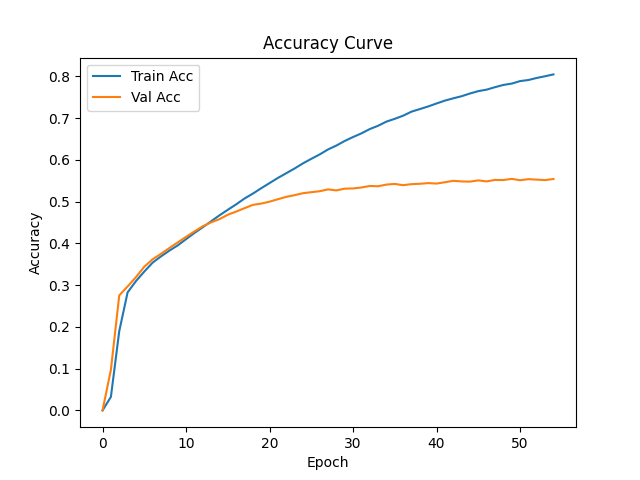
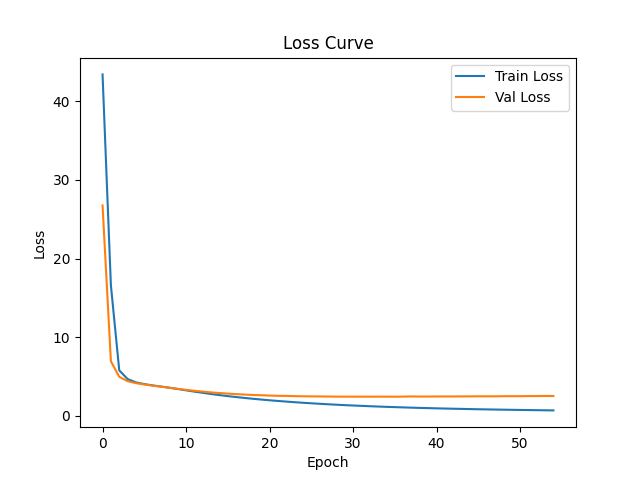
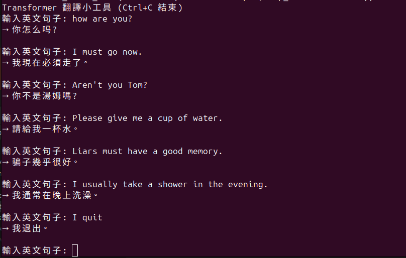
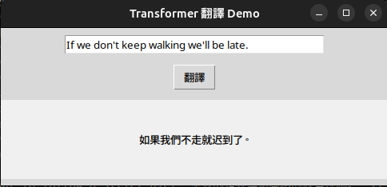
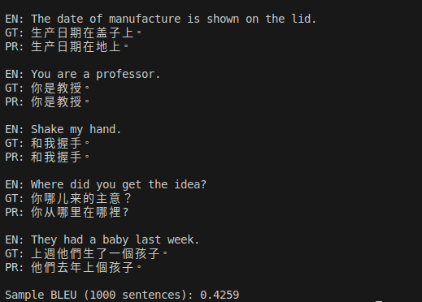

# 手刻 Transformer 中英文翻譯

## 簡介
本專案為 **從 0 到 1 手工打造的 Transformer 架構中英翻譯模型**，目標為深入理解 NMT（Neural Machine Translation）核心流程與 Transformer 架構實作細節。專案純為學習與研究用途，使用自建小型平行語料進行訓練，並透過 CLI 及簡易 GUI 介面進行推理展示。

目前翻譯品質受限於資料規模與硬體資源，部分輸出結果僅供參考／娛樂。但整體架構完整，並保留每階段學習與優化過程，未來預計持續提升模型效能與泛化能力。


---

## 資料集說明
- **來源**：自行蒐集的中英平行語料（`cmn.txt`）
- **規模**：約 23,444 組 英文 ↔ 簡體中文句對
- **格式**：每行一筆，格式為「英文[TAB]中文」

---

## 模型架構
- 模型類型：Encoder-Decoder Transformer（自建）
- Embedding size：128
- Transformer 層數：4
- Attention heads：4
- Max sequence length：64
- Tokenizer：`xlm-roberta-base`（僅用其 tokenizer，模型為自建）

---

## 訓練細節
- 損失函數：CrossEntropy
- Optimizer：AdamW
- Batch size：32
- 訓練 Epochs：50+
- 訓練環境：NVIDIA RTX 4070，PyTorch

---

## 訓練成效

### Accuracy Curve


### Loss Curve


- 最終 Train Accuracy：約 **0.80**
- Validation Accuracy：約 **0.55**
- 明顯出現 overfitting（過擬合）跡象
  
---

## 推理/測試方法

1. 準備好 \`cmn.txt\`（每行英文[TAB]中文）
2. 訓練：
   ```bash
   python train.py
   ```
3. 推理（CLI/GUI/Tkinter 介面）：
   ```bash
   python infer.py
   python app.py
   ```

---

## 推理結果範例

| 英文 | 中文 (模型預測) |
|---|---|
| I usually take a shower in the evening. | 我通常在晚上洗澡。 |
| I must go now. | 我現在必須走了。 |
| Please give me a cup of water. | 請給我一杯水。 |



---
## 評估指標
- 使用 1000 筆測試集句對計算 BLEU 分數
- BLEU score: **0.4259**
- 模型在短句與指令句有良好表現，但在時間副詞、語序轉換等複雜句結構上仍有誤譯情形，推測與訓練資料多為短句、上下文資訊不足有關。

---
## 🔍 Qualitative Error Analysis

- **良好預測**：
  - EN: _"Shake my hand."_
    - PR: 和我握手。

- **翻譯錯誤案例**：
  - EN: _"Where did you get the idea?"_
    - PR: 你從哪裡在哪裡？（語意混亂）

  - EN: _"They had a baby last week."_
    - PR: 他們去年上個孩子 （時態誤譯）



## 結論
- 模型可基本完成翻譯任務，具備可解釋性與可擴展性，但泛化能力仍不足。
- 資料量過小、語料雜訊、模型參數設計未最佳化，是準確率不穩定的主要因素。
- 本次實作強化了我對 Transformer 結構與 NLP 任務流程的理解，並深刻體認 「調參比人生還難」 這一真理。
- 最後想說一句話：
  - Attention is all you pay. 我已經決定把它裱框起來。

---

## TODO
- 增加資料規模（目標：>50,000 組句對）
- 清理現有語料，移除格式與語義雜訊 
- 加入 L2 regularization（weight decay）
- 評估是否改用預訓練模型（如 mBART / MarianMT）

